# Quantum Store - Sistema de Recomendación de Comercio Electrónico.

## Descripcion del Proyecto

Quantum Store es un sistema de comercio electrónico avanzado que implementa un motor de recomendaciones personalizadas basado en el comportamiento del usuario. El sistema permite:

1. Registro e inicio de sesión de usuarios
2. Exploración de productos por categorías
3. Gestión de carrito de compras y lista de deseos
4. Seguimiento de historial de productos visualizados
5. Generación de recomendaciones personalizadas basadas en:
    - Preferencias explícitas del usuario
    - Historial de visualización
    - Marcas y categorías frecuentes
    - Calidad de productos preferidos
    
El sistema utiliza estructuras de datos personalizadas como listas enlazadas, árboles binarios de búsqueda, sets y mapas para gestionar eficientemente los datos.

## Diagrama de Funciones y Relaciones

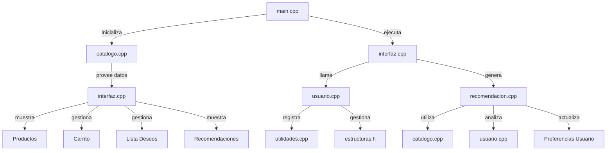

## Modulos principales.

1. main.cpp - Punto de entrada del programa.

- `main():` Inicializa el catálogo y ejecuta el menú principal.
  

2. interfaz.cpp - Gestión de la interfaz de usuario.

    
- `Mainmenu()`: Menú principal (registro/inicio sesión).
- `mostrarMenuUsuario()`: Menú post-login con todas las opciones.
- `verDetallesProducto()`: Muestra detalles de producto y actualiza historial.
- `verCarrito()`, `verListaDeseos()`, `verHistorial()`: Gestión de componentes.
  

3. usuario.cpp - Gestión de usuarios

    
- `ComandoRegistrarUsuario()`: Proceso de registro
- `ComandoIngresarUsuario()`: Proceso de inicio de sesión
- `seleccionarPreferencias()`: Selección de marcas/categorías preferidas

4. catalogo.cpp - Gestión de productos

    
- `inicializarCatalogo()`: Carga productos iniciales
- Funciones de búsqueda (`buscarPorCategoria`, `buscarPorMarca`, etc.)
- `obtenerCategoriasUnicas()`, `obtenerMarcasUnicas()`: Listados para UI

5. recomendacion.cpp - Motor de recomendaciones

- `generarRecomendaciones()`: Genera todas las recomendaciones
- `obtenerEstadisticasUsuario()`: Analiza comportamiento del usuario
- `actualizarPreferenciasDinamicas()`: Ajusta preferencias basadas en historial
- `obtenerTopN()`: Selecciona elementos más frecuentes

6. utilidades.cpp - Funciones auxiliares

    
- Generación de IDs, manipulación de strings
- Funciones de listas, sets y mapas
- Utilidades de UI (`clearScreen`, `pausarConsola`, etc.)

## Flujo principal del programa.

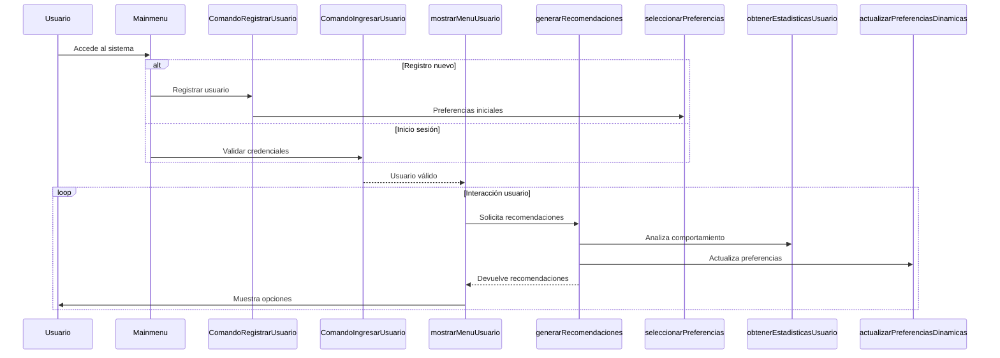

## Funcionamiento del sistema de recomendacion.

1. Análisis del comoportamiento del usuario

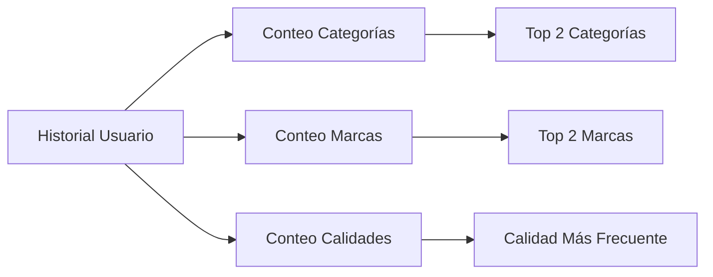

2. Actualización Dinámica de Preferencias

    
- Ajusta preferencias según productos visualizados
- Actualiza marcas y categorías preferidas

3. Generación de Candidatos

- Productos de marcas preferidas
- Productos de categorías preferidas
- Productos de calidad similar
- Productos de marcas frecuentes no preferidas

4. Filtrado y Presentación

    
- Excluye productos ya vistos/compras anteriores
- Mezcla aleatoria de resultados
- Presentación categorizada en la interfaz

## Listado completo de estructuras de datos.

Producto (estructuras.h)

- *Descripción*: Almacena información fundamental sobre los productos disponibles en la tienda.

    |Atributo  	    |Tipo	        |Descripción                      |
    |---------------|-------------|---------------------------------|
    |`descripcion`	|std::string	|Nombre/descripción del producto  |
    |`id`	          |int	        |Identificador único del producto |
    |`marca`	      |std::string	|Marca o fabricante del producto  |
    |`precio`	      |double	      |Precio del producto en dólares   |
    |`calidad`	    |int	        |Nivel de calidad (1-5 estrellas) |
    |`categoria`	  |std::string	|Categoría principal del producto |

NodoProducto (estructuras.h)

- *Descripción*: Nodo para lista enlazada de productos. Forma la base del catálogo global.

    |Atributo	    |Tipo	          |Descripción
    |-------------|---------------|--------------------------------------|
    |`dato`	      |Producto	      |Producto almacenado en el nodo        |
    |`siguiente`	|NodoProducto*	|Puntero al siguiente nodo en la lista |

Nodolista (estructuras.h)

- *Descripción*: Nodo genérico para listas enlazadas de strings. Se usa para múltiples propósitos.

    |Atributo	    |Tipo	        |Descripción                           |
    |-------------|-------------|--------------------------------------|
    |`dato`	      |std::string	|Valor de cadena almacenado            |
    |`siguiente`  |Nodolista*	  |Puntero al siguiente nodo en la lista |

NodoSetInt (estructuras.h)

- *Descripción*: Nodo para implementar conjuntos (sets) de enteros. Usado para exclusiones en recomendaciones.

    |Atributo	    |Tipo	        |Descripción                              |
    |-------------|-------------|-----------------------------------------|
    |`dato`	      |int	        |Valor entero almacenado                  |
    |`siguiente`	|NodoSetInt*	|Puntero al siguiente nodo en el conjunto |

NodoMapaStringInt (estructuras.h)

- *Descripción*: Nodo para mapas clave-valor donde la clave es string y el valor es entero. Usado para conteo de frecuencias.

    |Atributo	  |Tipo	              |Descripción                          |
    |-----------|-------------------|-------------------------------------|
    |clave	    |std::string	      |Clave del mapa                       |
    |valor	    |int	              |Valor entero asociado                |
    |siguiente	|NodoMapaStringInt*	|Puntero al siguiente nodo en el mapa |

NodoMapaIntInt (estructuras.h)

- *Descripción*: Nodo para mapas clave-valor donde ambos son enteros. Usado para conteo de calidades.

    |Atributo	    |Tipo	            |Descripción                          |
    |-------------|-----------------|-------------------------------------|
    |`clave`	    |int	            |Clave entera del mapa                |
    |`valor`	    |int	            |Valor entero asociado                |
    |`siguiente`  |NodoMapaIntInt*	|Puntero al siguiente nodo en el mapa |

Usuario (estructuras.h)

- *Descripción*: Almacena toda la información de un usuario registrado, incluyendo sus preferencias y actividad.

    |Atributo  	            |Tipo	        |Descripción                         |
    |-----------------------|-------------|------------------------------------|
    |`nombre`	              |std::string	|Nombre real del usuario             |
    |`apellido`	            |std::string	|Apellido del usuario                |
    |`id`	                  |std::string	|ID único del usuario                |
    |`usuario`	            |std::string	|Nombre de usuario (login)           |
    |`password`	            |std::string	|Contraseña del usuario              |
    |`preferencias`	        |ListaString	|Lista de marcas preferidas          |
    |`categoriasPreferidas`	|ListaString	|Lista de categorías preferidas      |
    |`historial`	          |ListaString	|IDs de productos vistos (historial) |
    |`carrito`	            |ListaString	|IDs de productos en el carrito      |
    |`listaDeseos`	        |ListaString	|IDs de productos en lista de deseos |

Nodoarbol (estructuras.h)

- *Descripción*: Nodo para árbol binario de búsqueda de usuarios. Permite almacenamiento y búsqueda eficiente.

    |Atributo	    |Tipo	        |Descripción                   |
    |-------------|-------------|------------------------------|
    |`dato`	      |Usuario	    |Usuario almacenado en el nodo |
    |`izquierda`	|Nodoarbol*	  |Puntero al hijo izquierdo     | 
    |`derecha`	  |Nodoarbol*	  |Puntero al hijo derecho       |

Recomendaciones (estructuras.h)

- *Descripción*: Contenedor para los resultados del sistema de recomendaciones, organizado por categorías.

    |Atributo	                  |Tipo	          |Descripción                                   |
    |---------------------------|---------------|----------------------------------------------|
    |`porMarcasPreferidas`	    |ListaProducto	|Productos de marcas explícitamente preferidas |
    |`porOtrasMarcasFrecuentes`	|ListaProducto	|Productos de marcas frecuentes no preferidas  |
    |`porCategoriaPreferida`	  |ListaProducto	|Productos de categorías preferidas            |
    |`porCategoriaFrecuente`	  |ListaProducto	|Productos de categorías más visitadas         |
    |`porCalidad`	              |ListaProducto	|Productos con calidad similar a lo habitual   |

EstadisticasUsuario (recomendacion.h)

- *Descripción*: Almacena estadísticas de comportamiento del usuario derivadas de su historial.

    |Atributo	              |Tipo	        |Descripción                           |
    |-----------------------|-------------|--------------------------------------|
    |`categoriasFrecuentes`	|ListaString	|Top 2 categorías más visitadas        |
    |`marcasFrecuentes`	    |ListaString	|Top 2 marcas más visitadas            |
    |`calidadFrecuente`	    |int	        |Calidad más común en productos vistos |

## Relación entre Estructuras

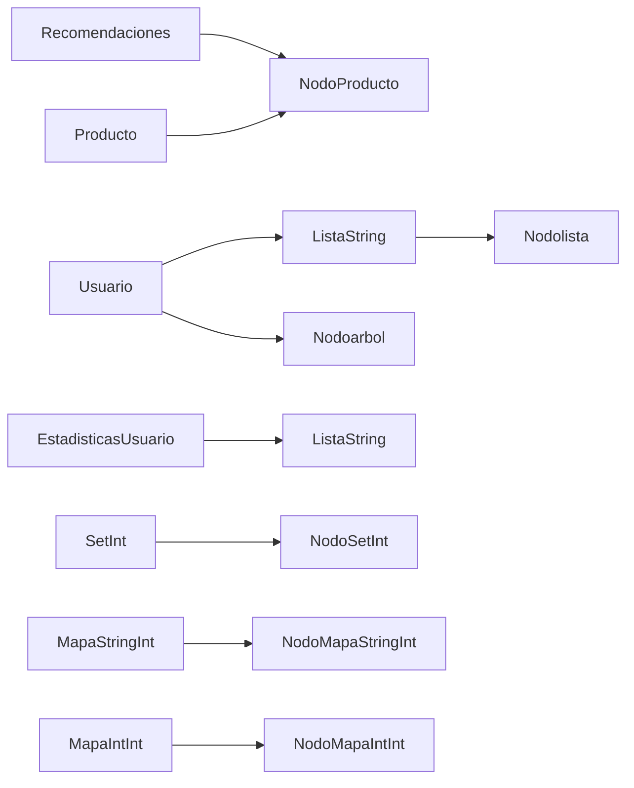

## Listado completo de funciones y agrupaciones.

Módulo Principal (main.cpp)
                                                       

|Función	|Descripción	                |Relaciones/Dependencias               |
|-----------|-------------------------------|--------------------------------------|
|`main()`	|Punto de entrada del programa	|`inicializarCatalogo()`, `Mainmenu()` |

Gestión de Usuarios (usuario.h/cpp)

|Función	                        |Descripción	                                |Relaciones/Dependencias                                                                    |    
|-----------------------------------|-----------------------------------------------|-------------------------------------------------------------------------------------------|
|`crearNodo(Usuario valor)`	        |Crea nuevo nodo de árbol para usuarios	        |-                                                                                          |
|`buscar(Nodoarbol*, string)`	    |Busca usuario en el árbol	                    |-                                                                                          |
|`insertar(Nodoarbol*&, Usuario&)`	|Inserta usuario en árbol binario de búsqueda	|`crearNodo()`                                                                              |
|`verificarPassword()`	            |Valida contraseña de usuario	                |-                                                                                          |
|`imprimirUsuario()`	            |Muestra detalles de usuario registrado	        |`encabezado()`, `pausarConsola()`                                                          |
|`seleccionarPreferencias()`	    |Selección de marcas/categorías preferidas	    |`obtenerMarcasUnicas()`, `obtenerCategoriasUnicas()`, `insertarLista()`, `existeEnLista()` |
|`ComandoRegistrarUsuario()`	    |Proceso completo de registro de usuario	    |`buscar()`, `generarID()`, `seleccionarPreferencias()`, `insertar()`, `imprimirUsuario()`  |
|`ComandoIngresarUsuario()`	        |Proceso de autenticación de usuario	        |`buscar()`, `verificarPassword()`                                                          |

Interfaz de Usuario (interfaz.h/cpp)

| Función                               | Descripción                                 | Relaciones/Dependencias                                                                                  |
|----------------------------------------|---------------------------------------------|----------------------------------------------------------------------------------------------------------|
| `mostrarMenuUsuario(Usuario*)`         | Menú principal después de login             | `verCarrito()`, `verListaDeseos()`, `verHistorial()`, `verDetallesProducto()`, `generarRecomendaciones()`, `buscarPorCategoria()`, etc. |
| `verCarrito(Usuario*)`                 | Muestra y gestiona carrito de compras       | Accede a `catalogoGlobal`                                                                               |
| `verListaDeseos(Usuario*)`             | Muestra y gestiona lista de deseos          | Accede a `catalogoGlobal`                                                                               |
| `verHistorial(Usuario*)`               | Muestra historial de productos vistos       | Accede a `catalogoGlobal`                                                                               |
| `verDetallesProducto(int, Usuario*)`   | Muestra detalles completos de un producto   | `insertarLista()` (para historial)                                                                      |
| `mostrarProductosPorCategoria()`       | Muestra productos por categoría específica  | `buscarPorCategoria()`                                                                                  |
| `Mainmenu()`                          | Menú principal del sistema                  | `ComandoRegistrarUsuario()`, `ComandoIngresarUsuario()`                                                 |

Catálogo de Productos (catalogo.h/cpp)

|Función	                |Descripción	                                    |Relaciones/Dependencias          |
|---------------------------|---------------------------------------------------|---------------------------------|
|`inicializarCatalogo()`	    |Carga productos iniciales en memoria	            |`insertarEnLista()`                |
|`buscarPorCategoria()`	    |Filtra productos por categoría	                    |`aMinusculas()`                    |
|`buscarPorRangoPrecios()`	|Filtra productos por rango de precios	            |-                                |
|`buscarPorMarca()`	        |Filtra productos por marca	                        |`aMinusculas()`                    |
|`buscarPorDescripcion()`	    |Busca productos por palabra clave en descripción	|`aMinusculas()`                    |
|`obtenerCategoriasUnicas()`	|Obtiene lista de categorías únicas	                |`existeEnLista()`, `insertarLista()` |
|`obtenerMarcasUnicas()`	    |Obtiene lista de marcas únicas	                    |`existeEnLista()`, `insertarLista()` |

Sistema de Recomendaciones (recomendacion.h/cpp)

| Función                           | Descripción                                         | Relaciones/Dependencias                                                                                   |
|------------------------------------|-----------------------------------------------------|-----------------------------------------------------------------------------------------------------------|
| `generarRecomendaciones(Usuario*)` | Genera todas las recomendaciones personalizadas      | `actualizarPreferenciasDinamicas()`, `obtenerEstadisticasUsuario()`, `insertarEnSet()`, `buscarEnSet()`, `insertarEnLista()`, `barajarLista()` |
| `obtenerEstadisticasUsuario()`     | Analiza comportamiento del usuario                  | `incrementarEnMapa()`, `obtenerTopN()`                                                                    |
| `actualizarPreferenciasDinamicas()`| Actualiza preferencias basadas en historial         | `incrementarEnMapa()`, `obtenerTopN()`                                                                    |
| `obtenerTopN()`                    | Obtiene elementos más frecuentes en un mapa         | `existeEnLista()`, `insertarLista()`                                                                      |

Utilidades (utilidades.h/cpp)

| Función                | Descripción                                   | Relaciones/Dependencias                   |
|------------------------|-----------------------------------------------|-------------------------------------------|
| `generarID()`          | Genera identificador único aleatorio          | -                                         |
| `aMinusculas()`        | Convierte texto a minúsculas                  | -                                         |
| `leertexto()`          | Lee entrada de usuario con validación         | -                                         |
| `clearScreen()`        | Limpia la pantalla de la consola              | -                                         |
| `pausarConsola()`      | Pausa la ejecución hasta presionar Enter      | -                                         |
| `opcioninvalida()`     | Muestra mensaje de opción inválida            | -                                         |
| `printCentered()`      | Imprime texto centrado                        | -                                         |
| `encabezado()`         | Imprime encabezado formateado                 | `printCentered()`                         |
| `seccion()`            | Imprime sección formateada                    | `printCentered()`                         |
| `insertarLista()`      | Inserta elemento en lista enlazada            | -                                         |
| `existeEnLista()`      | Verifica si elemento existe en lista          | -                                         |
| `insertarEnLista()`    | Inserta producto en lista de productos        | -                                         |
| `longitudLista()`      | Calcula longitud de lista de productos        | -                                         |
| `obtenerElementoEn()`  | Obtiene elemento en posición específica       | -                                         |
| `barajarLista()`       | Mezcla aleatoriamente lista de productos      | `longitudLista()`, `obtenerElementoEn()`  |
| `buscarEnSet()`        | Busca elemento en conjunto                    | -                                         |
| `insertarEnSet()`      | Inserta elemento en conjunto                  | `buscarEnSet()`                           |
| `incrementarEnMapa()`  | Incrementa contador en mapa                   | -                                         |
| `mapaEstaVacio()`      | Verifica si mapa está vacío                   | -                                         |

Estructuras de Datos (estructuras.h)

| Estructura             | Descripción                                 | Funciones Relacionadas                |
|------------------------|---------------------------------------------|---------------------------------------|
| Producto               | Almacena datos de productos                 | `mostrar()` (método)                  |
| NodoProducto           | Nodo para lista enlazada de productos       | Todas funciones de catálogo           |
| Nodolista              | Nodo para listas de strings                 | Funciones de listas en `utilidades`   |
| NodoSetInt             | Nodo para conjunto de enteros               | Funciones de `sets`                   |
| NodoMapaStringInt      | Nodo para mapa string→int                   | Funciones de `mapas`                  |
| NodoMapaIntInt         | Nodo para mapa int→int                      | Funciones de `mapas`                  |
| Usuario                | Almacena datos de usuario                   | Todas funciones de `usuario`          |
| Nodoarbol              | Nodo para árbol binario de usuarios         | Funciones de gestión de `usuarios`    |
| Recomendaciones        | Contenedor para resultados de recomendación | `generarRecomendaciones()`            |
| EstadisticasUsuario    | Almacena estadísticas de comportamiento     | `obtenerEstadisticasUsuario()`        |

## Agrupaciones funcionales

1. Gestión de Usuarios

- **Funciones**:
    - `crearNodo()`
    - `insertar()`
    - `buscar()`
    - `verificarPassword()`
    - `ComandoRegistrarUsuario()`
    - `ComandoIngresarUsuario()`

- **Estructuras**:
    - `Usuario`
    - `Nodoarbol`

- **Relaciones**:
    - Árbol binario de búsqueda para almacenamiento eficiente de usuarios

2. Interfaz de Usuario

- **Funciones**:
    - `mostrarMenuUsuario()`
    - `verCarrito()`
    - `verListaDeseos()`
    - `verHistorial()`
    - `verDetallesProducto()`
    - `Mainmenu()`

- **Estructuras**:
    - Utiliza estructuras de usuario y catálogo (`Usuario`, `Producto`, `NodoProducto`)

- **Relaciones**:
    - Menús jerárquicos con navegación entre diferentes secciones del sistema

3. Gestión de Catálogo

- **Funciones**:
    - `inicializarCatalogo()`
    - `buscarPorCategoria()`
    - `buscarPorRangoPrecios()`
    - `buscarPorMarca()`
    - `buscarPorDescripcion()`
    - `obtenerCategoriasUnicas()`
    - `obtenerMarcasUnicas()`

- **Estructuras**:
    - `Producto`
    - `NodoProducto`

- **Relaciones**:
    - Lista enlazada global `catalogoGlobal` almacena todos los productos

4. Sistema de Recomendaciones

- **Funciones**:
    - `generarRecomendaciones()`
    - `obtenerEstadisticasUsuario()`
    - `actualizarPreferenciasDinamicas()`
    - `obtenerTopN()`

- **Estructuras**:
    - `Recomendaciones`
    - `EstadisticasUsuario`

- **Relaciones**:
    - Algoritmo basado en 5 estrategias combinadas con actualización dinámica de preferencias

5. Utilidades y Estructuras de Datos

- **Funciones**:
    - Todas las funciones en `utilidades.h/cpp`

- **Estructuras**:
    - Todas las estructuras en `estructuras.h`

- **Relaciones**:
    - Tipos: Listas enlazadas, conjuntos, mapas, árboles binarios

6. Gestión de Estado

- **Variables Globales**:
    - `Nodoarbol* Usuarios`: Árbol de usuarios registrados
    - `ListaProducto catalogoGlobal`: Lista de todos los productos

- **Persistencia**:
    - Todos los datos se mantienen en memoria durante la ejecución

## Relaciones cruzadas

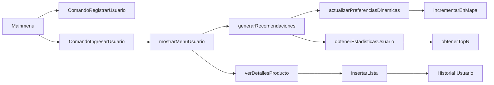

## Flujo principal del programa

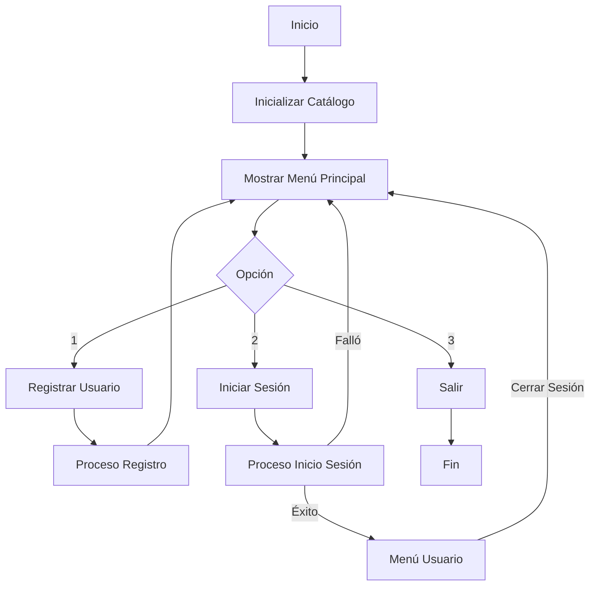

## Registro de usuario (ComandoRegistrarUsuario)

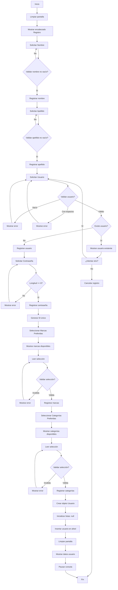

## Inicio de Sesión (ComandoIngresarUsuario)

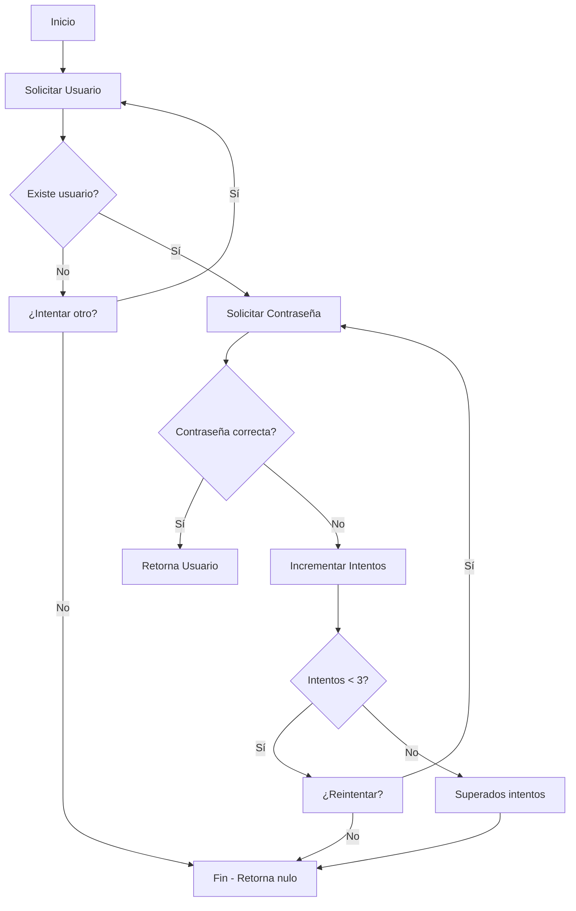
## Menú de Usuario (mostrarMenuUsuario)

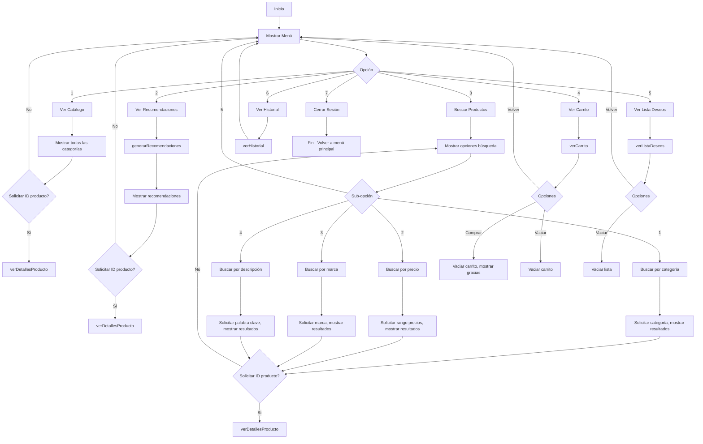

## Ver Detalles de Producto (verDetallesProducto)

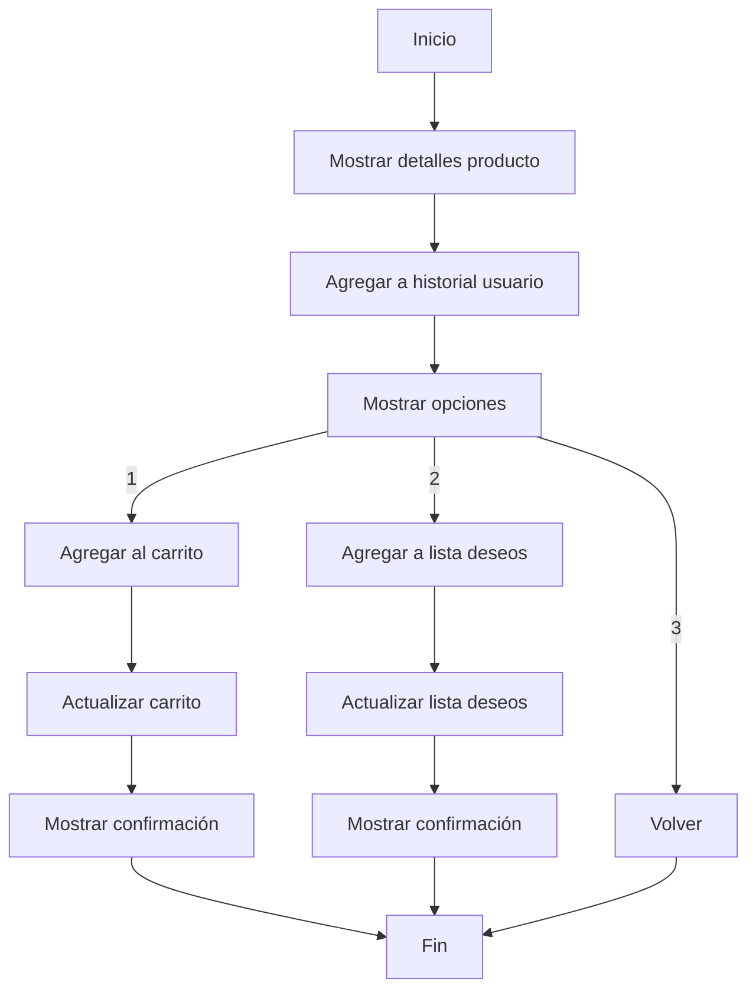

## Generación de Recomendaciones (generarRecomendaciones)

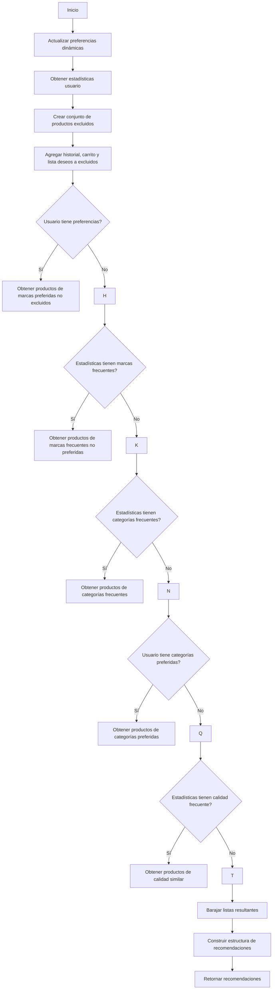

## Flujo de Actualización de Preferencias Dinámicas

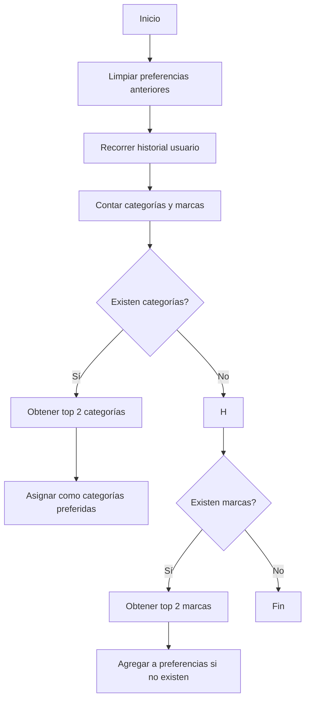

## Sistema de recomendacion

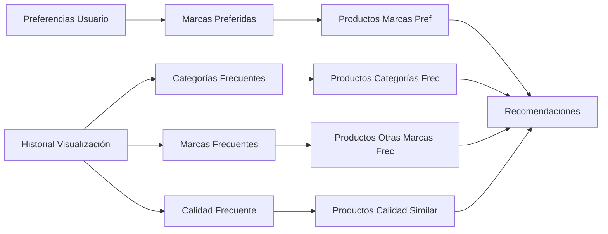
