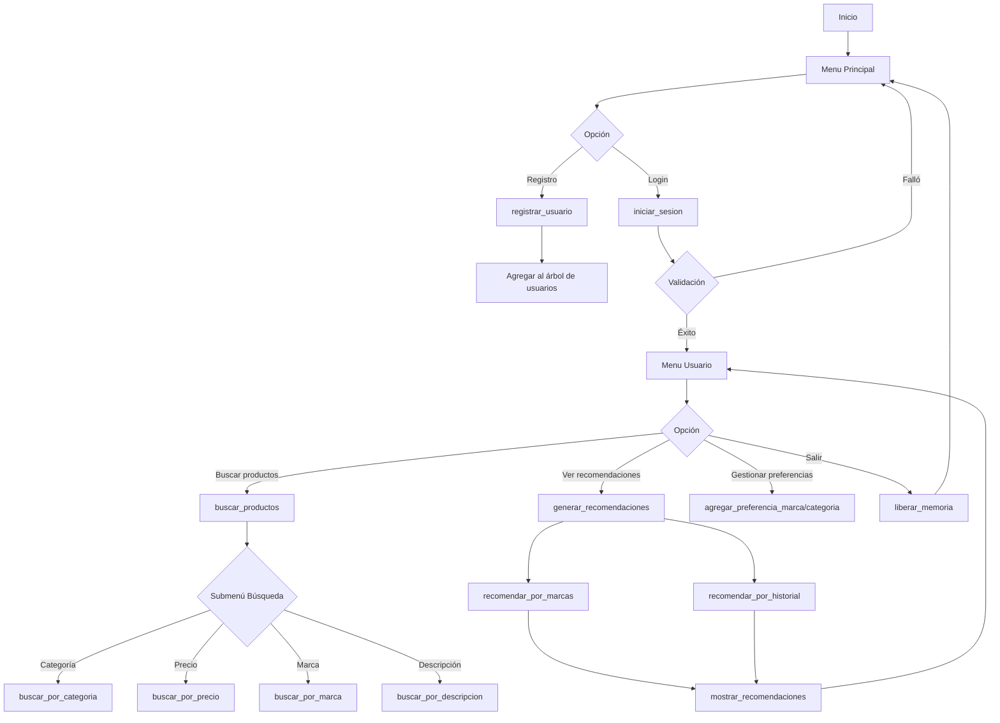
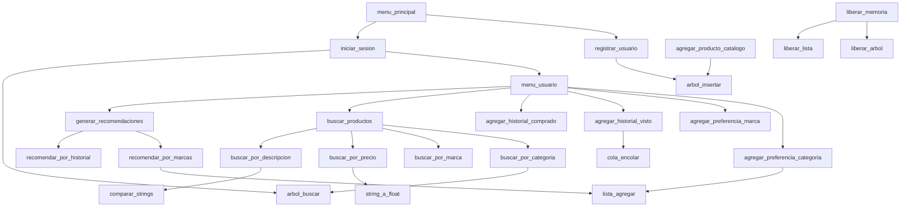

# Diagrama de funciónes

---

# Diagrama de relación de funciónes

---

# Listado de funciones

## Funciones Principales

|Nombre de la función       |Funcionalidad                                 |
|---------------------------|----------------------------------------------|
|**main()**                 |Punto de entrada, llama a **menu_principal()**|
|**menu_principal()**       |Muestra opciones iniciales (login/registro)   |
|**menu_usuario(Usuario*)** |Menú post-login con todas las funcionalidades |

## Gestión de Usuarios

|Nombre de la función                                |Funcionalidad                    |
|----------------------------------------------------|---------------------------------|
|**registrar_usuario()**                             |Crea nuevo usuario con input     |
|**iniciar_sesion()**                                |Valida credenciales contra árbol |
|**agregar_preferencia_categoria(Usuario*, char*)**  |Añade categoría a lista          |
|**agregar_preferencia_marca(Usuario*, char*)**      |Añade marca a lista              |
|**agregar_historial_visto(Usuario*, Producto*)**    |Agrega a cola FIFO               |
|**agregar_historial_comprado(Usuario*, Producto*)** |Agrega a lista                   |

## Gestión de Productos

|Nombre de la función                                |Funcionalidad                      |
|----------------------------------------------------|-----------------------------------|
|**crear_producto()**                                |Asigna memoria para nuevo producto |
|**agregar_producto_catalogo(Catalogo*, Producto*)** |Inserta en 4 árboles               |
|**buscar_por_categoria(Catalogo*, char*)**          |Devuelve lista de productos        |
|**buscar_por_marca(Catalogo*, char*)**              |Lista productos por marca          |
|**buscar_por_precio(Catalogo*, float, float)**      |Productos en rango                 |
|**buscar_por_descripcion(Catalogo*, char*)**        |Búsqueda textual recursiva         |

## Recomendaciones

|Nombre de la función                              |Funcionalidad                  |
|--------------------------------------------------|-------------------------------|
|**generar_recomendaciones(Usuario*, Catalogo*)**  |Coordina recomendaciones       |
|**recomendar_por_marcas(Usuario*, Catalogo*)**    |Filtra por marcas preferidas   |
|**recomendar_por_historial(Usuario*, Catalogo*)** |Sugiere similares al historial |

## Estructuras de Datos

|Nombre de la función                                      |Funcionalidad           |
|----------------------------------------------------------|------------------------|
|**arbol_insertar(NodoArbol**, void*, int (*comparar)())** |Inserción recursiva     |
|**arbol_buscar(NodoArbol*, void*, int (*comparar)())**    |Búsqueda recursiva      |
|**lista_agregar(Lista**, void*)**                         |Añade nodo a lista      |
|**cola_encolar(Cola*, void*)**                            |Añade elemento a cola   |
|**cola_desencolar(Cola*)**                                |Remueve primer elemento |

## Utilidades

|Nombre de la función               |Funcionalidad                     |
|-----------------------------------|----------------------------------|
|**comparar_strings(char*, char*)** |Comparación de cadenas            |
|**string_a_float(char*)**          |Conversión cadena a flotante      |
|**liberar_arbol(NodoArbol*)**      |Libera memoria de árbol recursivo |
|**liberar_lista(Lista*)**          |Libera lista enlazada             |
|**mostrar_productos(Lista*)**      |Imprime lista de productos        |
